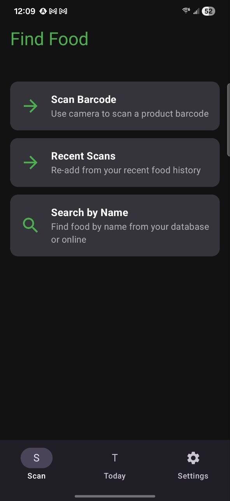
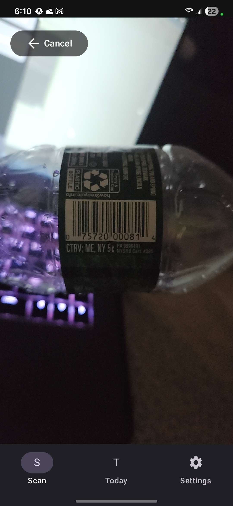
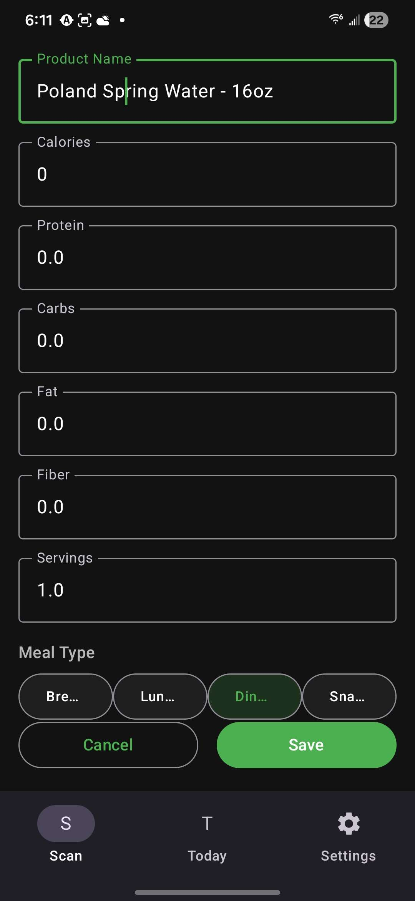
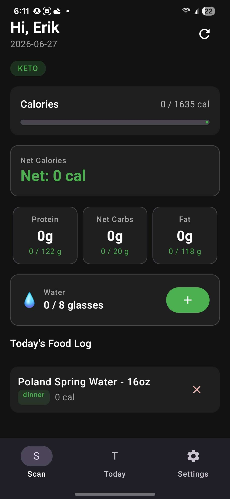
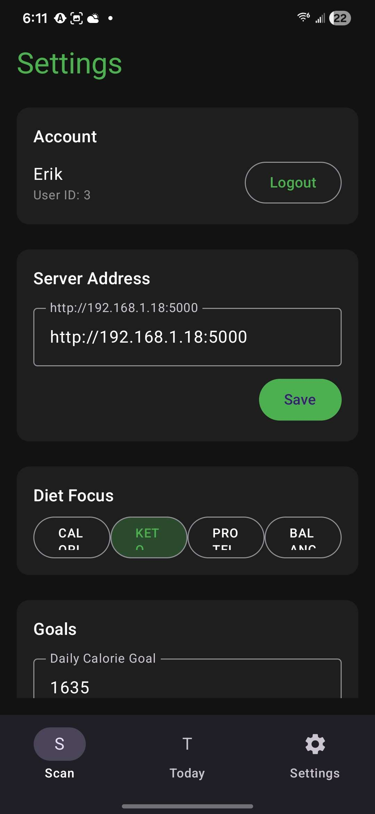
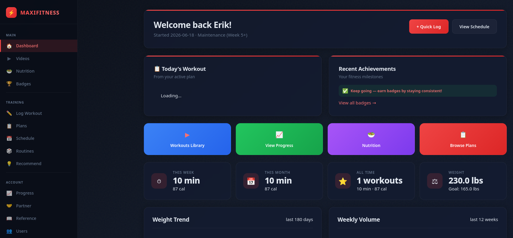
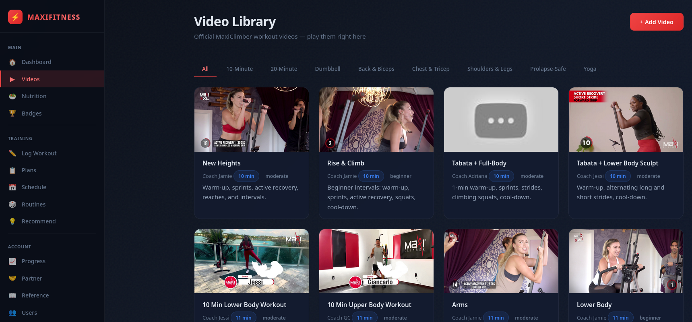

# MaxiFitness — Workout & Nutrition Tracker

A self-hosted, privacy-first fitness tracking platform with a responsive web dashboard and native Android barcode scanner. Built for people who want full control over their health data without paying subscription fees or surrendering it to a corporation. The workout focus is mainly the [MaxiClimber](https://maxiclimber.com/) machine but includes various home workouts.

---

## What It Is

MaxiFitness is a complete fitness tracking system split into two pieces:

- **Web Dashboard** — Flask/SQLite app served locally on your network. Track workouts, nutrition, body measurements, and progress photos. View analytics, streaks, badges, and structured workout plans from any browser.
- **Android App** — Native Kotlin/Compose app with barcode scanning for fast nutrition logging. Communicates with the web server over your local network.

Both pieces share the same SQLite database. Your data lives on your hardware, in your home.

---

## Screenshots

### Android App

| Scanner Home | Scanning | Scanned Result |
|:---:|:---:|:---:|
|  |  |  |

| Stats | Settings |
|:---:|:---:|
|  |  |

### Web Dashboard

| Dashboard | Video Library |
|:---:|:---:|
|  |  |

---

## Architecture

```
┌──────────────────────────────────────────────────┐
│  Your Network (192.168.x.x)                      │
│                                                  │
│  ┌─────────────┐      ┌──────────────────────┐  │
│  │  Android     │─────▶│  Raspberry Pi Server  │  │
│  │  (phone)     │ HTTP  │                      │  │
│  │  App         │◀─────│  Flask (port 5000)   │  │
│  │  (barcode    │      │  SQLite (maxifitness  │  │
│  │   scanner)   │      │   .db)               │  │
│  └─────────────┘      └──────────────────────┘  │
│                                                  │
│  ┌─────────────┐      ┌──────────────────────┐  │
│  │  Any Browser │─────▶│  Flask (port 5000)   │  │
│  │  (phone,     │ HTTP  │                      │  │
│  │   tablet,    │◀─────│  Jinja2 templates    │  │
│  │   desktop)   │      │  CSS/JS              │  │
│  └─────────────┘      └──────────────────────┘  │
└──────────────────────────────────────────────────┘
```

### Tech Stack

| Layer | Technology |
|-------|-----------|
| Backend | Python 3 + Flask |
| Database | SQLite (WAL mode, foreign keys enabled) |
| Web UI | Jinja2 templates, vanilla CSS (token-based theming), Chart.js |
| Android | Kotlin, Jetpack Compose, CameraX, ML Kit Barcode Scanning, OkHttp + Gson |
| Barcode API | ChowAPI (with 2-pass SQLite caching to minimize API calls) |
| Server | Raspberry Pi or any always-on Linux machine |

### Key Files

| File | Purpose |
|------|---------|
| `app.py` | Flask application — all routes, API endpoints, ChowAPI integration |
| `db.py` | Database schema, migrations, helper functions |
| `templates/` | Jinja2 HTML templates for all web pages |
| `static/css/` | Token-based CSS (00-tokens, 01-layout, 02-navigation, 03-components, 04-pages, 05-responsive) |
| `android/` | Full Android project (Gradle, Kotlin source) |

---

## Features

### Workout Tracking
- **Structured logging** — Log workouts with type, duration, calories burned, heart rate data, and exertion rating
- **Workout plans** — Follow structured multi-week programs with progressive phases (Foundation → Build → Maintenance)
- **Routine builder** — Create and save custom workout routines
- **Streaks & consistency** — Track daily/weekly workout streaks with visual feedback
- **Badges & achievements** — Earn badges for milestones (first workout, weekly consistency, monthly totals)
- **Heatmap visualization** — See your workout frequency across weeks at a glance
- **Weekly/monthly stats** — Aggregate data with EMA (exponential moving average) trends
- **AI-powered recommendations** — Get workout suggestions based on your history and variety score

### Nutrition Tracking
- **Barcode scanning** — Scan any packaged food with the Android app. Uses ChowAPI with 2-pass caching (local SQLite first, API only for new barcodes)
- **Macro tracking** — Calories, protein, carbs, fat, fiber, and net carbs (for keto)
- **Diet focus modes** — Switch between Calorie, Keto, Protein, and Balanced. Each mode adjusts what the dashboard emphasizes
- **Water tracking** — Log glasses of water with a daily goal
- **Serving multipliers** — Log partial or multiple servings of a scanned product
- **Product images** — See the actual product image from the barcode lookup to confirm accuracy
- **Recent scans** — Quick access to your most recent food entries for re-logging
- **Fiber & net carbs** — Full fiber tracking with net carb calculation (carbs - fiber) for keto dieters

### Progress & Body Composition
- **Weight tracking** — Log weight over time with trend visualization
- **Body measurements** — Track waist, chest, arms, thighs, hips with collapsible mobile-friendly forms
- **BMI calculation** — Automatic BMI from height and weight
- **BMR calculation** — Resting metabolic rate based on your stats
- **Progress photos** — Upload and compare body photos over time (with size limits and thumbnails)
- **Goal tracking** — Set start weight, goal weight, and track the journey

### Multi-User
- **Multiple profiles** — Each family member gets their own account with independent tracking
- **Partner goals** — Share goals and check in with a workout partner
- **Login persistence** — The Android app remembers who's logged in across sessions via a local config file

### Video Library
- **Curated workout videos** — Browse and watch workout videos organized by type and difficulty
- **Structured plan videos** — Follow along with videos tied to your current workout plan phase

---

## Setup

### Prerequisites

- **Python 3.10+** (for the Flask server)
- **Android SDK + Gradle** (for building the Android app, or sideload the APK)
- **ChowAPI key** — Get one at [chowapi.dev](https://chowapi.dev) (Builder pack: ~$20 for 25,000 lookups; with 2-pass caching, most scans hit local SQLite at zero API cost)

### 1. Clone and Configure

```bash
git clone <your-repo-url>
cd maxifitness

# Create your .env file with your secrets
cp .env.example .env
# Edit .env and fill in CHOW_API_KEY and SECRET_KEY
```

The `.env` file needs two values:

| Variable | Description | Example |
|----------|-------------|---------|
| `CHOW_API_KEY` | Your ChowAPI key from [chowapi.dev](https://chowapi.dev) | `chow_live_abc123...` |
| `SECRET_KEY` | Random string for Flask session cookies | Generate: `python3 -c "import secrets; print(secrets.token_hex(32))"` |

### 2. Install

```bash
./install.sh
```

This creates a Python virtual environment and installs all dependencies (Flask, gunicorn, Pillow, python-dotenv). It also creates `.env` from `.env.example` if it doesn't exist yet.

### 3. Start the Server

```bash
./run.sh
```

The server binds to `0.0.0.0:5000` so any device on your LAN can access it. Open `http://<your-server-ip>:5000` in a browser.

### 4. Build the Android App

```bash
cd android
./gradlew :app:assembleDebug
```

Output: `app/build/outputs/apk/debug/app-debug.apk`

Sideload to your phone:
```bash
adb install app/build/outputs/apk/debug/app-debug.apk
```

Open the app — it will prompt you to select a user. Update the server URL in Settings to point to your Pi's IP address.

### 5. Add Your Own Videos

80 curated workout videos ship by default. To add your own, go to the Video Library page and click **+ Add Video**. Paste a YouTube URL, set the name, category, intensity, and description — it's saved to the database instantly.
---

## API Endpoints (Android App)

| Method | Endpoint | Description |
|--------|----------|-------------|
| GET | `/api/users` | List all users |
| GET | `/api/nutrition/today?user_id=N` | Today's nutrition totals, goals, foods |
| GET | `/api/lookup-barcode/<code>` | Lookup barcode (2-pass: cache → ChowAPI) |
| GET | `/api/recent-scans?user_id=N` | Recent food entries |
| GET | `/api/search-foods?user_id=N&q=...&api=true/false` | Search foods (local or ChowAPI) |
| POST | `/nutrition/log-barcode?user_id=N` | Log a food entry |
| POST | `/nutrition/water?user_id=N` | Update water intake |
| POST | `/nutrition/goal?user_id=N` | Update calorie/macro goals |
| POST | `/nutrition/delete/<id>?user_id=N` | Delete a food entry |

---

## Database Schema

Core tables in `maxifitness.db`:

| Table | Purpose |
|-------|---------|
| `users` | User profiles (name, weight, height, BMI, goals) |
| `workouts` | Logged workouts (type, duration, calories, heart rate, exertion) |
| `nutrition_log` | Food entries (name, calories, macros, fiber, meal type, servings, barcode) |
| `daily_water` | Water intake per day |
| `calorie_goals` | Per-user calorie and macro goals with diet focus |
| `food_database` | Cached food data from ChowAPI |
| `barcode_cache` | 2-pass barcode lookup cache (barcode → nutrition data) |
| `settings` | Global app settings (units, start/goal weight) |
| `routines` | Custom workout routines |
| `plans` | Structured workout programs |
| `videos` | Workout video library |
| `badges` | Achievement definitions and user progress |

All migrations are idempotent (wrapped in `try/except sqlite3.OperationalError`).

The database file (`*.db`) is in `.gitignore` and is **never committed**. On first run, `init_db()` creates all tables automatically.

---

## Android App Architecture

```
ui/
├── MainActivity.kt          # App shell, login routing, bottom nav
├── AppViewModel.kt          # Shared state, login/logout, API calls
├── login/
│   └── LoginScreen.kt      # User selection screen (shown when not logged in)
├── scanner/
│   └── ScannerScreen.kt    # Scan menu + camera barcode scanner
├── confirm/
│   └── ConfirmScreen.kt    # Review/edit scanned food before saving
├── nutrition/
│   └── NutritionScreen.kt  # Daily nutrition dashboard
├── recent/
│   └── RecentScansScreen.kt # Recent food history
├── search/
│   └── SearchScreen.kt     # Food search (local + API)
└── settings/
    └── SettingsScreen.kt   # Account, server URL, diet focus, goals, console log

data/
├── ApiClient.kt             # OkHttp client for HTTP requests
├── ConfigManager.kt         # File-based login persistence (maxifitness.config)
├── LogBuffer.kt             # Thread-safe in-memory log buffer
└── model/
    └── Models.kt            # Data classes (User, FoodEntry, BarcodeLookupResult, etc.)
```

### Config File
The app uses a plain text config file (`maxifitness.config`) in the app's private storage directory. On login, it writes `ID=<user_id>`, `NAME=<user_name>`, and `SERVER_URL=<url>`. On every app launch, `ConfigManager` reads this file to restore the logged-in user and server address. On logout, the user fields are cleared but the server URL persists.

---

## Barcode Lookup Flow (2-Pass)

```
Scan barcode → Flask endpoint
    │
    ├─ Pass 1: SELECT * FROM barcode_cache WHERE barcode = ?
    │     ├─ HIT → return cached data instantly (0.1s)
    │     └─ MISS → continue to Pass 2
    │
    └─ Pass 2: GET https://api.chowapi.dev/v1/barcode/{barcode}
          ├─ 200 → parse response → INSERT into barcode_cache → return
          ├─ 404 → return { success: false, error: "not found" }
          └─ ERR → return { success: false, error: "<message>" }
```

Cached entries are tagged with `source`:
- `branded` — came from ChowAPI (manufacturer-reported)
- `user_entered` — user manually entered after ChowAPI 404

---

## Why This Over MyFitnessPal, Cronometer, Lose It!, or Others?

### Your Data Is Yours — Permanently
Every paid app stores your data on their servers. They can change terms of service, sell aggregated data, delete your account, or go out of business. MaxiFitness stores everything in a SQLite file on your own hardware. No cloud, no terms of service, no data mining.

### No Subscription, Ever
The total cost of running MaxiFitness is the hardware you already own:
- **Server:** A Raspberry Pi (~$35 one-time) or any always-on computer
- **Android app:** Free — sideload the APK, no Play Store required
- **Barcode API:** ChowAPI at ~$20 for 25,000 lookups, but 2-pass caching means most scans hit local SQLite (zero API cost). A single $20 pack covers years of use.

### No Ads, No Upsell, No Nags
Zero monetization. No ads, no upgrade prompts, no feature gates. What you see is what you get.

### Privacy-First by Design
- No tracking pixels, no analytics SDKs, no crash reporting services
- No phone number or email required — just a name
- No social features that expose your data to strangers (partner sharing is opt-in and local-only)
- No camera/microphone access beyond what's needed (barcode scanning is local ML Kit, no image upload)

### Diet Flexibility Without Paywalls
- **Keto mode** with net carbs (carbs - fiber) — locked behind Premium in MyFitnessPal
- **Protein-focused tracking** with per-meal macro goals — Premium-only in MFP
- **Custom calorie and macro goals** — free here, $79.99/yr elsewhere
- **Fiber tracking** — included, not gated

### Workout Tracking + Nutrition in One Place
Most apps specialize in one or the other. MaxiFitness combines both in a single system. Your workout calories factor into your daily nutrition totals. You don't need two apps and two subscriptions.

---

## Design Philosophy

Built from research across 10 leading fitness apps (Fitbod, Strong, NTC, JEFIT, Hevy, MyFitnessPal, Lose It!, Cronometer, Yazio). Key principles:

1. **Reduce friction to the core action** — Barcode scanning gets you from camera to logged food in ~3 seconds
2. **Progressive disclosure** — Simple views by default, expand for detail
3. **Data tells stories** — Greeting, on-track/over-budget status, streaks and badges
4. **Mobile-first for logging, desktop-friendly for analytics** — Android app handles the fast path, web dashboard handles the deep dive
5. **Dark theme with green accent** — Consistent across web and Android

---

## Testing

```bash
source venv/bin/activate
python3 test_all.py
```

Runs the full automated test suite: page loads, API endpoints, POST actions, weigh-ins, and plan routes.

---

## License

MIT
